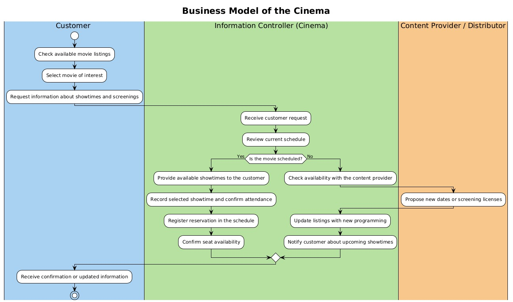

# 🎞️ Workshop 2 — Cinema Management System

**Authors:** Nicolás Guevara Herrán — Samuel Antonio Sánchez Peña — Jorge Enrique Acosta Jiménez  
**University:** Universidad Distrital Francisco José de Caldas  

This workshop builds upon the previously defined *Cinema Management System* and reports concrete design and implementation progress. It includes updated architecture and class diagrams, a customer-oriented business process model, deployment details, and the current status of the web application (implemented interfaces and pending mockups).  
All related diagrams and screenshots are organized within the `resources/Diagrams` and `resources/Mockups-Web UI` folders.

---

## 🧩 1. Class Diagrams

The class diagrams provide a detailed static view of the system’s internal structure for both microservices:  
- **Auth Service (Java + Quarkus + Keycloak)**  
- **Cinema Service (Python + Flask)**  

They describe the main classes, attributes, methods, and interrelations that define each service’s data model and business logic.

### 🔹 Python Backend

### 🔹 Java Authentication Service

---

## 🏗️ 2. Architecture Diagram

This diagram shows the reference architecture for the Cinema Management System.  
The solution follows a **microservices-based approach** to separate authentication and cinema-related logic, promoting scalability and modularity.

**Components:**
- **Auth Service:** Java + Quarkus + Keycloak + MySQL  
- **Cinema Service:** Python + Flask + PostgreSQL  
- **Frontend:** React.js SPA  
- **API Gateway:** Central entry point for routing between frontend and microservices  

---

## ☁️ 3. Deployment Diagram

The deployment diagram illustrates how the system is hosted on **Microsoft Azure**.  
A **GitHub Actions CI/CD pipeline** builds and pushes Docker images to **Azure Container Registry (ACR)**, which are then deployed as container apps.  
The React frontend runs in an Azure Web App, while the API Gateway routes traffic to the Java (Auth) and Python (Cinema) microservices, both connected to managed MySQL and PostgreSQL databases.

---

## 🔄 4. Business Process — Customer Role

This diagram outlines the **business workflow from the customer’s perspective**, describing interactions between the user, the cinema (information controller), and the content provider.

The process includes:
1. Browsing movie listings  
2. Requesting showtime information  
3. System validation of schedule availability  
4. Reservation registration and confirmation  

---

## 💻 5. Web UI Screenshots

### ✅ Implemented Features
These screenshots correspond to fully functional pages integrated with the backend:

- **Login:** `Login-screenshot.png`  
- **Register:** `Register-screenshot.png`  
- **Forgot Password:** `ForgotPassword-screenshot.png`  
- **Users Management:** `UsersManagement-screenshot.png`  
- **Movie Catalog:** `MovieCatalog-Screenshot.jpeg`  
- **Movie Management:** `MovieManagement-Screenshot.jpeg`  
- **Add Movie:** `AddMovie-Screenshot.png`  

### 🧱 Pending UI (Mockups)
The following mockups illustrate features still under development.  
They serve as design references for the next implementation cycle:

- `AddFunction-screenshot.png`  
- `EditMovie-screenshot.png`  
- `DeleteMovie-screenshot.png`  
- `DeleteFunction-screenshot.png`  
- `FunctionsOFAMovie-screenshot.png`  
- `MovieFunctionAssociation-screenshot.png`  

---

## 📂 Folder Structure

