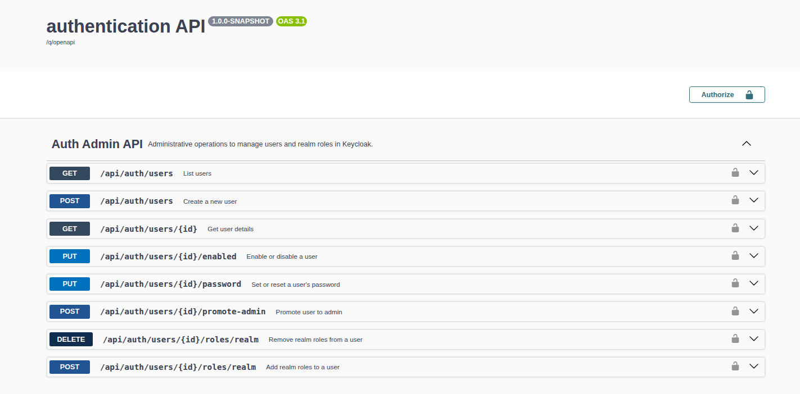
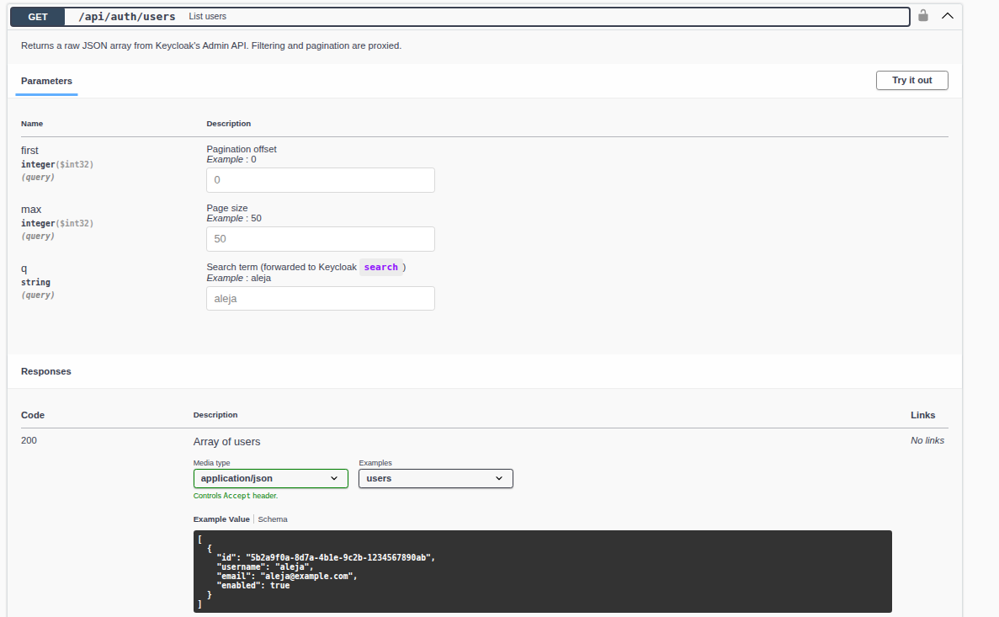
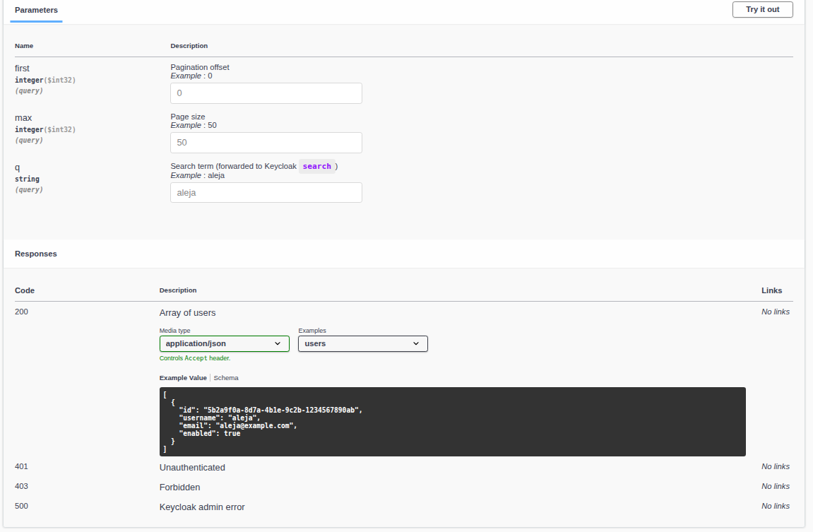
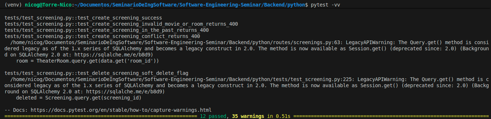
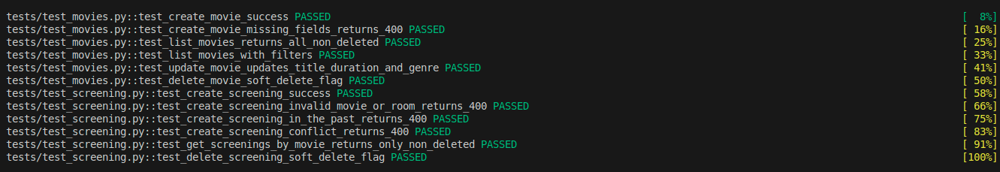
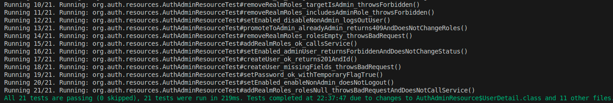
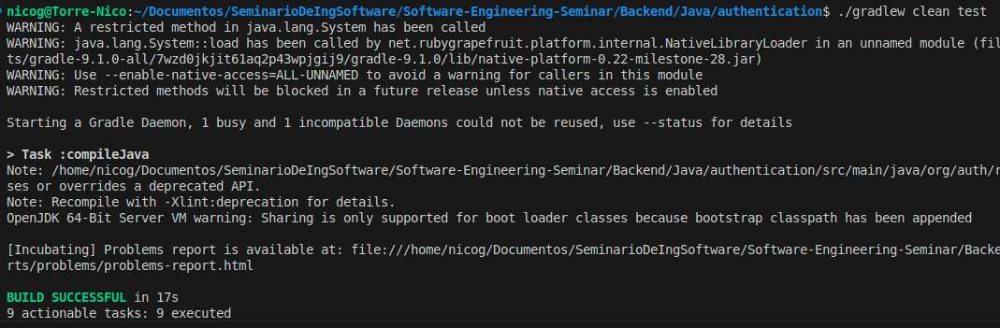

# Workshop-3

Members:
- Nicolás Guevara Herrán
- Samuel Antonio Sánchez Peña
- Jorge Enrique Acosta Jiménez
---

## 1. Source Code for Backends

### 1.1 Python

The Python backend is located in the folder [`python-backend`](./python-backend).  
It implements the **business logic** of the cinema application using **Flask** and **SQLAlchemy**, exposing REST endpoints to manage movies and screenings.

The main components are:

- `app.py`  
  Initializes the Flask application, loads environment variables, configures the PostgreSQL connection via SQLAlchemy, and registers the API blueprints under the `/api` prefix.  
  It also exposes basic health-check endpoints (`/` and `/health`) to verify that the backend and database configuration are working.

- `database.py`  
  Centralizes the database configuration and creates the global `db` instance used by all models.  
  It builds the PostgreSQL connection string from environment variables (`DB_USER`, `DB_PASSWORD`, `DB_HOST`, `DB_PORT`, `DB_NAME`) and initializes SQLAlchemy.

- `models.py`  
  Defines the ORM data model for the cinema domain: `User`, `Genre`, `Movie`, `TheaterRoom`, `Screening`, and `Ticket`.  
  These models include relationships between entities (for example, one `Genre` to many `Movie`, one `Movie` to many `Screening`, one `User` to many `Ticket`, etc.).

- `routes/movies.py`  
  Contains the REST endpoints to create, list, update and **soft delete** movies:
  - `POST /api/movies` – create a movie (creating the genre on the fly if needed)  
  - `GET /api/movies` – list movies with optional filters by title and genre  
  - `PUT /api/movies/<id>` – update movie title, duration and genre  
  - `DELETE /api/movies/<id>` – soft delete a movie by marking it as `is_deleted = True`

- `routes/screenings.py`  
  Contains the REST endpoints to manage screenings (showtimes) for movies:
  - `POST /api/screenings` – create a new screening, validating movie/room existence, preventing past dates and scheduling conflicts  
  - `GET /api/screenings/<movie_id>` – list screenings for a specific movie  
  - `DELETE /api/screenings/<id>` – soft delete a screening

Together, these components form the **Python backend** responsible for the core cinema operations (movies and screenings), while the Java backend focuses on authentication and user/role management.


### 1.2 Java

The Java backend is located in the folder [`java-backend`](./java-backend).  
It implements authentication and user administration using **Keycloak** as the identity provider.  
The backend is developed with **Quarkus (Java)** and communicates with Keycloak’s Admin REST API to manage users, roles, and groups.


## 2. Database Connection Scripts/Configuration

### 2.1 Python

The Python backend connects to a **PostgreSQL** database using the **SQLAlchemy ORM**.  
All database connection parameters are loaded from environment variables defined in a `.env` file, ensuring secure and configurable deployment both locally and inside Docker containers.

The connection setup is defined in the file **`database.py`**, which:

- Initializes the global `db` object.
- Dynamically constructs the PostgreSQL connection string based on environment variables.

---

#### Connection Setup (`database.py`)

```python
from flask_sqlalchemy import SQLAlchemy
from flask import Flask
from dotenv import load_dotenv
import os

# Load variables from .env
load_dotenv()

db = SQLAlchemy()

def init_db(app: Flask):
    # Build the PostgreSQL connection URI
    user = os.getenv("DB_USER", "postgres")
    password = os.getenv("DB_PASSWORD", "enlaceprueba")
    host = os.getenv("DB_HOST", "host.docker.internal")  # important when running with Docker
    port = os.getenv("DB_PORT", "5432")
    name = os.getenv("DB_NAME", "moviedb")

    app.config["SQLALCHEMY_DATABASE_URI"] = f"postgresql://{user}:{password}@{host}:{port}/{name}"
    app.config["SQLALCHEMY_TRACK_MODIFICATIONS"] = False

    db.init_app(app)
````

---

#### Key Features

* Reads PostgreSQL credentials (`DB_USER`, `DB_PASSWORD`, `DB_HOST`, `DB_PORT`, `DB_NAME`) from the `.env` file.
* Dynamically builds the SQLAlchemy connection URI.
* Initializes a shared `db` instance used across all models in the backend.

---

#### Example `.env` File

```bash
DB_USER=postgres
DB_PASSWORD=enlaceprueba
DB_HOST=host.docker.internal
DB_PORT=5432
DB_NAME=moviedb
SECRET_KEY=dev_secret_key
```

---

#### Database Initialization in `app.py`

When the Flask application starts, the database schema is automatically created within the app context:

```python
from database import db
import os

DB_NAME = os.getenv("DB_NAME")
DB_HOST = os.getenv("DB_HOST")
DB_PORT = os.getenv("DB_PORT")

with app.app_context():
    db.create_all()
    print("✅ Database tables created successfully!")
    print(f"Connected to DB: {DB_NAME} on {DB_HOST}:{DB_PORT}")
```

---

### ✅ Summary

This setup ensures:

* Secure configuration using environment variables.
* Easy integration with Docker environments.
* Automatic database initialization on app startup.

```

---

✅ **Listo para copiar:**  
Si pegas esto directamente en tu `README.md`, GitHub o cualquier editor Markdown lo mostrará perfectamente con los bloques de código (Python, Bash, etc.), títulos y formato consistente.  

¿Quieres que le agregue también una pequeña sección final de “Troubleshooting” (errores comunes de conexión a PostgreSQL)?
```


### 2.2 Java

The Java backend does not connect directly to a relational database.  
Instead, it communicates with **Keycloak**, which in turn uses **MySQL** as its persistence layer.  
All authentication data (users, roles, groups, sessions) are stored in the MySQL instance managed by Keycloak.

The connection between Keycloak and MySQL is defined in the project’s `docker-compose` configuration, using two services: `mysql-db` (MySQL) and `keycloak` (Keycloak server).


#### Docker Compose configuration (MySQL + Keycloak)

```yaml
mysql-db:
  image: mysql:8.0
  container_name: mysql-java
  restart: always
  environment:
    MYSQL_DATABASE: keycloak
    MYSQL_USER: keycloak
    MYSQL_PASSWORD: keycloak
    MYSQL_ROOT_PASSWORD: root
  command: --default-authentication-plugin=mysql_native_password
  volumes:
    - kc_data:/var/lib/mysql
  healthcheck:
    test: ["CMD", "mysqladmin", "ping", "-h", "localhost", "-u", "keycloak", "-pkeycloak"]
    interval: 10s
    timeout: 5s
    retries: 20
  ports:
    - "3306:3306"

keycloak:
  image: quay.io/keycloak/keycloak:26.0
  command:
    - start-dev
    - --import-realm
  environment:
    KEYCLOAK_ADMIN: admin
    KEYCLOAK_ADMIN_PASSWORD: admin
    KC_DB: mysql
    KC_DB_URL: jdbc:mysql://mysql-db:3306/keycloak?allowPublicKeyRetrieval=true&useSSL=false&characterEncoding=UTF-8
    KC_DB_USERNAME: keycloak
    KC_DB_PASSWORD: keycloak
    KC_HTTP_ENABLED: "true"
    KC_HOSTNAME_STRICT: "false"
    KC_HEALTH_ENABLED: "true"
  volumes:
    - ./keycloak/realms:/opt/keycloak/data/import
    - ../Frontend/themes:/opt/keycloak/themes
  depends_on:
    mysql-db:
      condition: service_healthy
  ports:
    - "8080:8080"
  healthcheck:
    test: ["CMD-SHELL", "bash -lc 'exec 3<>/dev/tcp/127.0.0.1/8080'"]
    interval: 10s
    timeout: 5s
    retries: 30
```

## 3. REST API Documentation

### 3.1 Python

The **Python backend** exposes a REST API that manages **movies** and **screenings** within the cinema domain.
All endpoints are documented using **OpenAPI 3.0**, following the same structure and level of detail as the Java backend.
The documentation is available both as a YAML file and as a static interactive HTML page.

#### 📄 Static Documentation

A complete OpenAPI specification was created manually based on the Flask routes defined in
[`python-backend/routes/movies.py`](./python-backend/routes/movies.py)
and [`python-backend/routes/screenings.py`](./python-backend/routes/screenings.py).

The static version of the API documentation was generated using **ReDoc**, providing an interactive visualization of all endpoints, request/response schemas, and examples.

* **OpenAPI YAML**: [`docs/openapi-python.yaml`](./docs/openapi-python.yaml)
* **Full HTML Documentation**: [`docs/python-business-api.html`](./docs/python-business-api.html)

You can open the HTML file locally in any browser to explore the complete API documentation.

#### 🧩 Endpoint Documentation

Each route in the Python backend is thoroughly documented directly within the source code using structured **docstrings**.
These docstrings describe, for each endpoint:

* HTTP method and URL (e.g., `POST /api/movies`)
* Expected request body and example payloads
* Path and query parameters
* Possible response codes and example responses
* Behavior and validation rules

This makes the code **self-explanatory and OpenAPI-compatible**, allowing future automatic generation of YAML or Swagger UI documentation if needed.

Examples of documented endpoints include:

* `POST /api/movies` — Creates a new movie and its associated genre if it does not exist.
* `GET /api/movies` — Lists all active movies, with optional filters by title and genre.
* `PUT /api/movies/{id}` — Updates title, duration, and genre of an existing movie.
* `DELETE /api/movies/{id}` — Soft deletes a movie by marking it as inactive.
* `POST /api/screenings` — Registers a new screening, validating scheduling conflicts.
* `GET /api/screenings/{movie_id}` — Lists all screenings for a given movie.
* `DELETE /api/screenings/{id}` — Soft deletes a screening while keeping historical data.

#### 💡 Integration Summary

By combining **OpenAPI YAML**, **ReDoc HTML**, and **in-code docstrings**,
the Python backend achieves full documentation transparency, mirroring the structure and professionalism of the Java REST API.


### 3.2 Java

The **Java backend** provides a complete OpenAPI documentation.  
This documentation describes all REST API endpoints under `/api/auth`, including request/response examples, authentication details, and error codes.

#### 📄 Static Documentation

A static HTML version of the documentation was generated using **ReDoc** from the OpenAPI specification exposed by Quarkus at `/q/openapi`.

- **OpenAPI JSON**: [`docs/openapi-auth.json`](./docs/openapi-auth.json)  
- **Full HTML Documentation**: [`docs/auth-admin-api.html`](./docs/auth-admin-api.html)

You can open the HTML file locally in any browser to view the complete interactive documentation.

#### 🔗 Live Swagger UI

During development, the live Swagger UI can be accessed to watch the REST API documentation.  
Here you can see how it actually looks when running in the browser:

<p align="center">
  <br/>
  <em>Figure 1. General view of the OpenAPI documentation.</em>
</p>

<p align="center">
  <br/>
  <em>Figure 2. Schemas section showing request and response models.</em>
</p>

<p align="center">
  <br/>
  <em>Figure 3. Example of the <code>GET /api/auth/users</code> endpoint documentation.</em>
</p>

<p align="center">
  <br/>
  <em>Figure 4. Example response preview from the Swagger UI.</em>
</p>


## 4. Unit Test Results and code

### 4.1 Python

Unit tests for the Python backend were implemented using **pytest** and the **Flask test client**.
The tests run against an in-memory **SQLite** database, so no external PostgreSQL instance is required.

The main goals of these tests are:

* Validate the core business logic of the **movies** API:

  * `POST /api/movies` – creation with required fields and genre handling
  * `GET /api/movies` – listing only non-deleted movies and supporting filters by title/genre
  * `PUT /api/movies/<id>` – updating title, duration and genre
  * `DELETE /api/movies/<id>` – soft delete using the `is_deleted` flag

* Validate the core business logic of the **screenings** API:

  * `POST /api/screenings` – creation validating:

    * existing movie and room
    * no screenings in the past
    * no duplicate (room, date, time) combinations
  * `GET /api/screenings/<movie_id>` – listing only non-deleted screenings for a movie
  * `DELETE /api/screenings/<id>` – soft delete using the `is_deleted` flag

All tests passed successfully, confirming that the Python backend correctly enforces validation rules, soft-delete semantics and query filters.

---

#### ✅ Evidence of Test Execution (Python)

<p align="center">
  <br/>
  <em>Figure 1. Pytest execution showing all movie and screening tests passing.</em>
</p>

<p align="center">
  <br/>
  <em>Figure 2. Detailed pytest output confirming that all 12 tests completed successfully.</em>
</p>

---

#### 🧰 Command Used

From the `python-backend` directory (with the virtual environment activated):

```bash
pytest -vv
```


### 4.2 Java

Unit tests for the Java backend were implemented using **JUnit 5** and **Mockito**.  
These tests validate the core logic of the `AuthAdminResource` class without requiring a live Keycloak server.  
Mocked instances of `KcAdminService` and `SecurityIdentity` are used to simulate interactions and verify behavior.

#### 🧪 Test Summary

- The tests cover key operations such as:
  - Creating a new user (`createUser_ok_returns201AndId`)
  - Handling missing required fields (`createUser_missingFields_throwsBadRequest`)
- All tests executed successfully with no errors or skipped tests.
- The build result confirmed a successful execution of all tasks and assertions.

---

#### ✅ Evidence of Test Execution

<p align="center">
  <br/>
  <em>Figure 1. All two unit tests running successfully — both passed in under 1.2 seconds.</em>
</p>

<p align="center">
  <br/>
  <em>Figure 2. Gradle build showing successful test execution with <code>BUILD SUCCESSFUL</code>.</em>
</p>

---

#### 🧰 Command Used

The tests can be executed directly using Gradle:

```bash
./gradlew clean test
```

## 5. Evidence of Web GUI Integration

This section presents the progress and visual evidence of the **Cinema Management System Web UI**, which integrates both the **frontend (React + Tailwind)** and the **backend (Flask + PostgreSQL)** components.  
The interface maintains a consistent color palette (`#1E1E1E`, `#D90429`, `#FFDA63`) for visual coherence and usability.

### 🎬 5.1 Catalog Page

Displays the list of available movies dynamically fetched from the Flask backend.  
Each card shows the movie title, genre, and duration, maintaining the modern dark theme with red borders and golden accent buttons.


---

### 🔐 5.2 Login Screen

The login interface is fully integrated with **Keycloak**, allowing secure authentication.  
It follows the same visual identity: black background, red primary button, and yellow Google sign-in button.


---

### 📝 5.3 Register Screen

The registration form allows new users to create an account in Keycloak.  
All input fields include proper validation and retain the dark-themed styling.


---

### 🔄 5.4 Forgot Password Screen

Implements the password recovery flow integrated with Keycloak, providing users a simple interface to reset their credentials.


---

### 🧑‍💼 5.5 Users Management Screen

Accessible only for administrators, this page lists all users registered in the system.  
It includes functionalities to **search**, **deactivate**, and **assign roles** dynamically, styled consistently with the rest of the UI.


